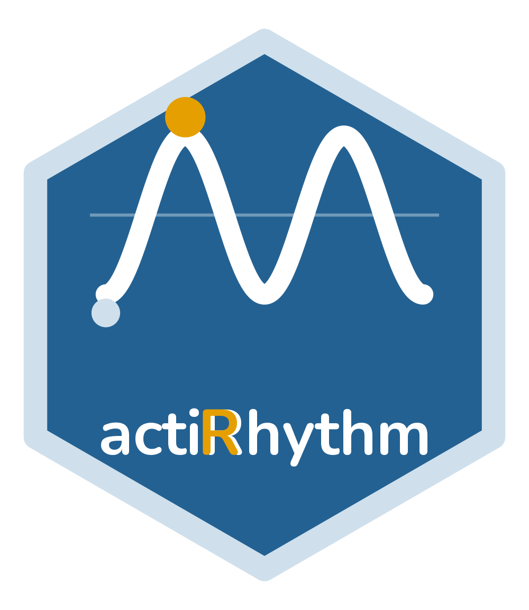

---
output:
  github_document:
    html_preview: false
---

<!-- README.md is generated from README.Rmd. Edit the .Rmd and re-knit. -->

```{r setup, include = FALSE}
knitr::opts_chunk$set(
  collapse = TRUE,
  comment = "#>",
  fig.path = "man/figures/README-",
  out.width = "100%",
  dpi = 120,
  message = FALSE,
  warning = FALSE
)
```

# actiRhythm 

<!-- badges: start -->
[](https://github.com/rdazadda/actiRhythm/actions/workflows/R-CMD-check.yaml)
[](https://opensource.org/licenses/MIT)
[](https://lifecycle.r-lib.org/articles/stages.html#experimental)
<!-- badges: end -->

**actiRhythm measures circadian rest-activity rhythms from activity counts or raw
acceleration.** It works on a count vector and its timestamps and reads those counts
straight out of an ActiGraph `.agd` file. It also reads raw `.gt3x`, `.cwa`, and `.bin`
recordings, auto-calibrates them, and derives the ENMO, MAD, and z-angle signals that
agree with GGIR. From one recording it produces the metrics a
chronobiology analysis reports, from the nonparametric measures through cosinor,
periodograms, and fractal structure. Every analysis returns a typed object that
prints its own metrics and plots with one call.

You can usually see the answer before computing it. Plot the recording as an
actogram and a regular sleeper forms a single vertical band of activity at the same
clock time each day, while a drifting rhythm scatters across the panel. The methods
that follow put numbers to what that picture shows, and each carries the reference
that defined it, from Witting (1990) and van Someren (1999) through the cosinor and
the periodogram.

## Installation

```r
# install.packages("remotes")
remotes::install_github("rdazadda/actiRhythm")
```

actiRhythm needs R 4.1 or newer and a C++17 compiler (Rtools on Windows, the Xcode
command-line tools on macOS) for the small backend behind its nonparametric metrics.

## A first analysis

One ActiGraph recording ships with the package, so this runs without any data of
your own. The bundled file is a single de-identified 60-second-epoch recording,
included only so the examples run.

```{r first-analysis}
library(actiRhythm)

# Read the bundled .agd and pull the count series
agd <- agd.counts(read.agd(example_agd(1), verbose = FALSE))

# Describe the rest-activity rhythm without assuming a waveform
rhythm <- circadian.rhythm(agd$axis1, agd$timestamp)
rhythm
```

The actogram is usually the first thing worth plotting.

```{r actogram, fig.height = 5, fig.cap = "Double-plotted actogram: each row is one day shown twice across 48 hours, so a stable rhythm forms a vertical band of activity at the same clock time each day, while scattered fill marks a fragmented or shifting rhythm."}
plot_actogram(agd$axis1, agd$timestamp)
```

For this recording a high relative amplitude near 0.98 sits with a low interdaily
stability near 0.23: the days are strongly active, but the pattern does not land at
the same clock time from one day to the next.

Every number and figure here regenerates from the installed package and its bundled
recording, and the calculations behind them are exercised by the package's test
suite.

## Going further

The same recording runs through the rest of the package. `cosinor.analysis()` fits a
24-hour cosine (Cornelissen 2014) and `rhythmicity.test()` checks whether the rhythm
is statistically real. `circadian.period()` estimates the free-running period from a
Lomb-Scargle periodogram (Lomb 1976), `period.ci()` puts a bootstrap confidence
interval on it, and `circadian.spectrogram()` shows how that period drifts across the
recording. `fractal.dfa()` measures the long-range correlation in the series (Peng
1994), and `multiscale.entropy()` and `mfdfa()` describe its finer nonlinear
structure. `circadian.flm()` fits a functional (multi-harmonic) model of the daily
profile and `circadian.ssa()` decomposes the recording into trend, circadian, and
noise components. `sleep.regularity.index()` (Phillips 2017), `social.jet.lag()`, and
`state.transitions()` summarise sleep timing and rest-activity fragmentation, and
`sleep.changepoints()` locates each night's sleep and wake onset directly from the
counts (Chen and Sun 2024). `sleep.cole.kripke()` and `sleep.sadeh()` score each
epoch as sleep or wake (Cole et al. 1992; Sadeh et al. 1994), and `rest.periods()`
(Roenneberg et al. 2015) and `rest.crespo()` (Crespo et al. 2012) consolidate every
rest bout across the recording, naps included, by two independent algorithms.

A further set of methods covers the harder cases. `circadian.wavelet()` gives the
time-frequency power surface, `ultradian.bandpower()` the dyadic ultradian bands,
and `circadian.emd()` with `hilbert.huang()` a data-adaptive decomposition and
instantaneous phase. `cosinor.multicomponent()` fits a multi-harmonic shape,
`activity.onset.offset()` marks daily onset and offset, and `phase.concentration()`
tests day-to-day phase clustering. `rest.hmm()` is a state-space rest-activity model,
`curve.registration()` aligns daily profiles for a scale-invariant chronotype phase,
and `residual.spectrum()` spectra what the cosinor leaves behind. `circadian.daily()`,
`intradaily.variability.multiscale()`, `activity.extrema()`, and `dichotomy.index()`
complete the nonparametric set.

Counts can come from more than `.agd` files: `read.actigraph.csv()` reads ActiLife
epoch CSVs and `counts.from.data.frame()` takes a count series from any data frame.
`read.raw()` turns raw ActiGraph `.gt3x`, Axivity `.cwa`, and GENEActiv `.bin` files
into counts with the agcounts band-pass filter, and `gt3x.counts()`, `axivity.counts()`,
and `geneactiv.counts()` do the same per brand. Cross-brand counts are an approximation
rather than native ActiGraph output. `detect.nonwear.choi()` and
`detect.nonwear.troiano()` flag non-wear time directly from the counts to use as the
wear filter (Choi et al. 2011; Troiano et al. 2008).

Raw acceleration also gives the gravity-based metrics that counts cannot carry.
`raw.metrics()` returns per-epoch ENMO, MAD and the z-angle with van Hees (2014)
auto-calibration, and `circadian.raw()` runs every method above on ENMO from a single
call. The z-angle also supports a sleep pipeline that needs no diary, which counts
cannot do. `rest.spt()` finds the nightly sleep-period window (HDCZA, van Hees 2018)
and `sib.vanhees()` scores sustained-inactivity bouts (van Hees 2015); `sleep.from.spt()`
turns them into onset, wake, WASO and efficiency. `detect.nonwear.raw()` gates out a
device taken off and left still, so it is not read as sleep (van Hees 2011).
`activity.balance.index()` and `transition.probability()` add two fragmentation
estimators.

When a study has many files, `circadian.batch()` runs the whole pipeline over a
folder and returns one row per recording, and `circadian.workbook()` writes a full
analysis to a multi-sheet Excel file. Every plotting function returns a `ggplot`
object you can theme and save with `save.circadian.plot()`.

## Documentation

`vignette("actiRhythm")` walks through a full analysis, from reading a file to
exporting the results. Each function's help page carries its method reference, so
`?circadian.rhythm`, `?cosinor.analysis`, and `?circadian.period` are good places to
read more. Questions and bug reports go to the issue tracker at
<https://github.com/rdazadda/actiRhythm/issues>, and contributions are welcome (see
`CONTRIBUTING.md`).

## Citation

Run `citation("actiRhythm")` for the entry to use in published work. When you
publish results, report the version you ran, from `packageVersion("actiRhythm")`, so
the analysis stays reproducible across releases.

## License

MIT, see [LICENSE](LICENSE).

actiRhythm is developed and maintained by the Center for Alaska Native Health
Research at the University of Alaska Fairbanks.
